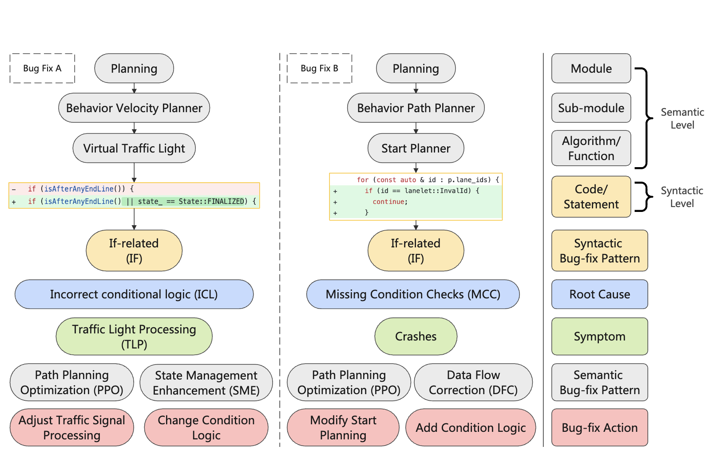
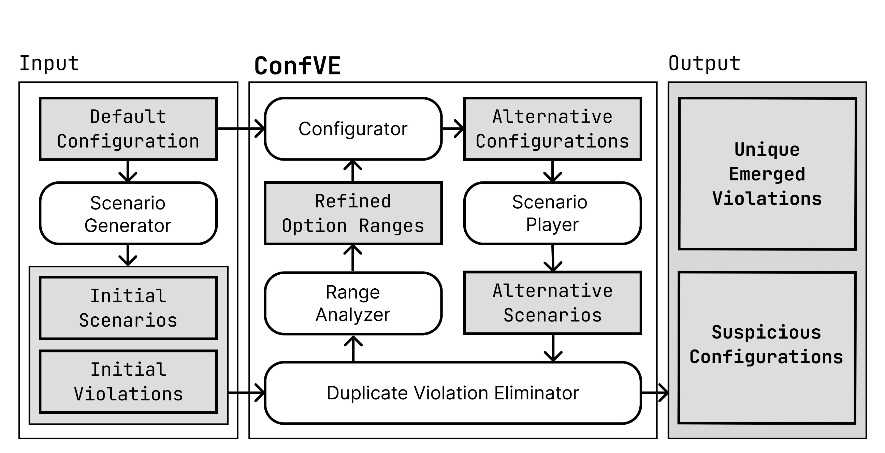
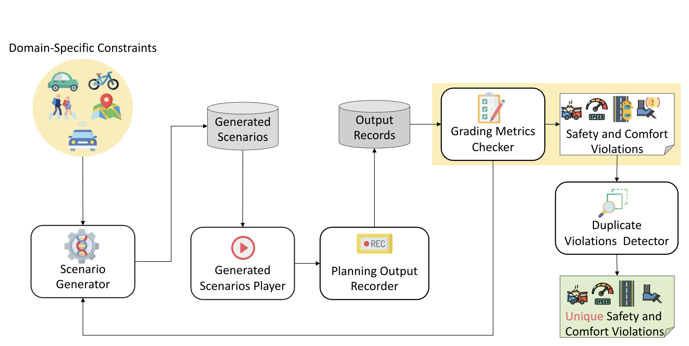
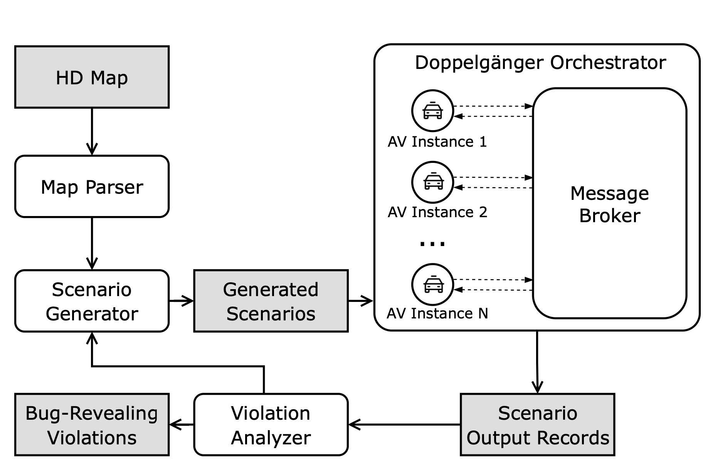








Yuntianyi Chen is a Ph.D. candidate in software engineering at the University of California, Irvine. His research interests include scenario generation and automated testing of autonomous driving systems, performance prediction and ranking of software configurations, and using AI/ML approaches to solve more software engineering (SE) and autonomous driving system (ADS) problems.
He joined the Software Aurora (SORA) Lab in 2021. His Ph.D. advisor is Prof. [Joshua Garcia](https://jgarcia.ics.uci.edu/).

<!-- Yuntianyi Chen is a Ph.D. candidate of software engineering at the University of California, Irvine. His research interests include software testing and performance ranking of software configurations. He joined the Software Aurora (SORA) Lab in 2021. His advisor is Prof. [Joshua Garcia](https://jgarcia.ics.uci.edu/). -->

<u>Research Domains:</u>
- Autonomous Driving Systems
- Software Testing
- Machine Learning
<!-- - Machine Learning -->
<!-- - Searach-based Testing -->
<!-- - Transfer Learning -->

# 📖 Education

- *2021.09 - Present*, **Ph.D. Candidate** in Software Engineering
  - University of California, Irvine, USA
  - Donald Bren School of Information and Computer Sciences
  - **Master of Science** degree has been earned en route to the Ph.D.
- *2016.09 - 2020.06*, **Bachelor** of Computer Science and Technology
  - Wuhan University, China
  - School of Computer

<!-- Nov 22, 2019 1:00 PM Hangzhou, China -->

<!-- - *2021.03*, Lorem ipsum dolor sit amet, consectetur adipiscing elit. Vivamus ornare aliquet ipsum, ac tempus justo dapibus sit amet.  \| [\[video\]](https://github.com/) -->

<!-- # 💻 Internships
- *2019.05 - 2020.02*, [Lorem](https://github.com/), China. -->

# 🔥 Highlights

FSE 2025

[A Comprehensive Study of Bug-Fix Patterns in Autonomous Driving Systems](../attachments/FSE_2025_Bug-Fix-Patterns.pdf)

<u>Yuntianyi Chen</u>, Yuqi Huai, Yirui He, Shilong Li, Changnam Hong, Qi Alfred Chen, Joshua Garcia

Proc. ACM Softw. Eng. 2, FSE (2025). **(Accepted, To be published)**

<!-- --- -->

 

**Top-tier Conference Paper**

FSE 2024

[Misconfiguration Software Testing for Failure Emergence in Autonomous Driving Systems](../attachments/FSE_2024_ConfVE.pdf)

<u>Yuntianyi Chen</u>, Yuqi Huai, Shilong Li, Changnam Hong, Joshua Garcia

Proc. ACM Softw. Eng. 1, FSE (2024), 1913–1936.

<!-- --- -->

 

**Top-tier Conference Paper**

TSE 2023

[scenoRITA: Generating Diverse, Fully Mutable, Test Scenarios for Autonomous Vehicle Planning](../attachments/TSE_2023_scenoRITA.pdf)

Yuqi Huai, Sumaya Almanee, <u>Yuntianyi Chen</u>, Xiafa Wu, Qi Alfred Chen, Joshua Garcia

IEEE Trans. Software Eng. 49, 10 (2023), 4656–4676.

<!-- --- -->

 

**Top-tier Journal Paper**

ICSE 2023

[Doppelgänger Test Generation for Revealing Bugs in Autonomous Driving Software](../attachments/ICSE_2023_DoppelTest.pdf)

Yuqi Huai, <u>Yuntianyi Chen</u>, Sumaya Almanee, Tuan Ngo, Xiang Liao, Ziwen Wan, Qi Alfred Chen, Joshua Garcia

In 45th IEEE/ACM International Conference on Software Engineering, ICSE 2023, Melbourne, Australia, May 14-20, 2023. IEEE, 2591–2603.

<!-- --- -->

 

**Top-tier Conference Paper**

<!-- - *2022.02*: &nbsp;🎉🎉 Lorem ipsum dolor sit amet, consectetur adipiscing elit. Vivamus ornare aliquet ipsum, ac tempus justo dapibus sit amet.  -->
<!-- - *2022.02*: &nbsp;🎉🎉 Lorem ipsum dolor sit amet, consectetur adipiscing elit. Vivamus ornare aliquet ipsum, ac tempus justo dapibus sit amet.  -->

# 📝 Publications 

- **[FSE 2025]** [A Comprehensive Study of Bug-Fix Patterns in Autonomous Driving Systems](../attachments/FSE_2025_Bug-Fix-Patterns.pdf), <u>Yuntianyi Chen</u>, Yuqi Huai, Yirui He, Shilong Li, Changnam Hong, Qi Alfred Chen, Joshua Garcia. Proc. ACM Softw. Eng. 2, FSE (2025). **(Accepted, To be published)**

- **[FSE 2024]** [Misconfiguration Software Testing for Failure Emergence in Autonomous Driving Systems](https://dl.acm.org/doi/abs/10.1145/3660792), <u>Yuntianyi Chen</u>, Yuqi Huai, Shilong Li, Changnam Hong, Joshua Garcia. Proc. ACM Softw. Eng. 1, FSE (2024), 1913–1936.

- **[TSE 2023]** [scenoRITA: Generating Diverse, Fully Mutable, Test Scenarios for Autonomous Vehicle Planning](https://ieeexplore.ieee.org/abstract/document/10234383), Yuqi Huai, Sumaya Almanee, <u>Yuntianyi Chen</u>, Xiafa Wu, Qi Alfred Chen, Joshua Garcia. IEEE Trans. Software Eng. 49, 10 (2023), 4656–4676.

- **[ICSE 2023]** [Doppelgänger Test Generation for Revealing Bugs in Autonomous Driving Software](https://ieeexplore.ieee.org/abstract/document/10172903), Yuqi Huai, <u>Yuntianyi Chen</u>, Sumaya Almanee, Tuan Ngo, Xiang Liao, Ziwen Wan, Qi Alfred Chen, Joshua Garcia. In 45th IEEE/ACM International Conference on Software Engineering, ICSE 2023, Melbourne, Australia, May 14-20, 2023. IEEE, 2591–2603.

- **[APSEC 2019]** [Multi-Objective Configuration Sampling for Performance Ranking in Configurable Systems](https://ieeexplore.ieee.org/abstract/document/8945705), Yongfeng Gu, <u>Yuntianyi Chen</u>, Xiangyang Jia, Jifeng Xuan. In 26th Asia-Pacific Software Engineering Conference, APSEC 2019, Putrajaya, Malaysia, December 2-5, 2019. IEEE, 150–157.

- **[SOFL+MSVL 2019]** [Regression Models for Performance Ranking of Configurable Systems: A Comparative Study](https://link.springer.com/chapter/10.1007/978-3-030-41418-4_17), <u>Yuntianyi Chen</u>, Yongfeng Gu, Lulu He, Jifeng Xuan. In Structured Object-Oriented Formal Language and Method - 9th International Workshop, SOFL+MSVL 2019, Shenzhen, China, November 5, 2019. Springer, 243–258.

# 📚 Service

#### Organization

- *2024.09*, [Web & Publicity Chair](https://conf.researchr.org/home/icse-2025/se4ads-2025), 47th IEEE/ACM International Conference on Software Engineering (ICSE 2025), 1st International Workshop on Software Engineering for Autonomous Driving Systems (SE4ADS 2025)
- *2021.04*, Local Arrangements Chair, The Workshop of Intelligent Real-time Methods and Technologies of Quality Improvement based on Co-programming

#### Program Committee

- *2024.09*, [Program Committee Member](https://conf.researchr.org/home/icse-2025/se4ads-2025), 47th IEEE/ACM International Conference on Software Engineering (ICSE 2025), 1st International Workshop on Software Engineering for Autonomous Driving Systems (SE4ADS 2025)
- *2024.09*, [Program Committee Member](https://conf.researchr.org/track/icse-2025/icse-2025-artifact-evaluation), 47th IEEE/ACM International Conference on Software Engineering (ICSE 2025), Artifacts Evaluation Track
- *2024.05*, [Program Committee Member](https://www.sigsac.org/ccs/CCS2024/organization/ae-committee.html), 31st ACM Conference on Computer and Communications Security (CCS 2024), Artifacts Evaluation Track
- *2024.03*, [Program Committee Member](https://conf.researchr.org/track/icsa-2024/artifact-evaluation-track), 21st International Conference on Software Architecture (ICSA 2024), Artifacts Evaluation Track

#### Reviewer
- *2025.04*, Reviewer, IEEE Transactions on Intelligent Transportation Systems (T-ITS), Journal Paper
- *2025.01*, Reviewer, 47th IEEE/ACM International Conference on Software Engineering (ICSE 2025), Artifacts Evaluation Track
- *2024.12*, Reviewer, ACM Transactions on Software Engineering and Methodology (TOSEM), Journal Paper
- *2024.11*, Reviewer, 47th IEEE/ACM International Conference on Software Engineering (ICSE 2025), 1st International Workshop on Software Engineering for Autonomous Driving Systems (SE4ADS 2025)
- *2024.11*, Reviewer, IEEE Transactions on Software Engineering (TSE), Journal Paper
- *2024.07*, Reviewer, ACM Transactions on Software Engineering and Methodology (TOSEM), Journal Paper
- *2024.05*, External Reviewer, 33rd ACM SIGSOFT International Symposium on Software Testing and Analysis (ISSTA 2024), Technical Papers
- *2024.05*, Reviewer, 31st ACM Conference on Computer and Communications Security (CCS 2024), Artifacts Evaluation Track
- *2024.04*, External Reviewer, 47th IEEE/ACM International Conference on Software Engineering (ICSE 2025), Research Track
- *2024.03*, Reviewer, 21st International Conference on Software Architecture (ICSA 2024), Artifacts Evaluation Track
- *2024.01*, Reviewer, IEEE Robotics and Automation Letters (IEEE RA-L), Journal Paper
- *2023.10*, Delegate Reviewer, 41st IEEE International Conference on Robotics and Automation (ICRA 2024), Contributed Papers
- *2023.10*, External Reviewer, 32nd ACM International Conference on the Foundations of Software Engineering (FSE 2024), Research Papers
- *2022.12*, Sub-Reviewer, 20th IEEE International Conference on Software Architecture (ICSA 2023), Technical Track
- *2019.11*, Sub-Reviewer, 27th IEEE International Conference on Software Analysis, Evolution and Reengineering (SANER 2020), Research Track

#### Volunteer

- *2023.12*, Student Volunteer, 31st ACM Joint European Software Engineering Conference and Symposium on the Foundations of Software Engineering (ESEC/FSE 2023)
- *2023.05*, Student Volunteer, Southern California Software Engineering Symposium (SuCSES 2023)

# 💬 Talks

- *2019.11.22*, Paper Presentation, “Regression Models for Performance Ranking of Configurable Systems: A Comparative Study” at the Annual Conference on Software Analysis, Testing and Evolution (SATE 2019), Hangzhou, China

# 🎖 Honors and Awards

- *2024*, ACM SIGSOFT CAPS Award
- *2023*, NSF Student Travel Award
- *2021*, Chair's Award, University of California, Irvine
- *2017-2018, 2016-2017, and 2018-2019*, Scholarship for Outstanding Students (Top 5%)
- *2018*, Chinese Undergraduate Computer Design Contest (Provincial Level, Second Prize)

# 💻 Experience

- *2021.09 - Present*, **Graduate Student Researcher**, Software Aurora (SORA) Lab, University of California, Irvine
  - Conducting research in areas of Autonomous Driving Systems, Software Testing, and Machine Learning under the supervision of Prof. [Joshua Garcia](https://jgarcia.ics.uci.edu/)
- *2021.09 - Present*, **Teaching Assistant**, University of California, Irvine
  - SWE 241P - Applied Data Structures and Algorithms
  - SWE 243P - Database Programming
  - SWE 247P - Applied Information Retrieval
  - SWE 249P - Applied Data Analytics
  - SWE 266P - Software Security and Dependability
  - I&C SCI 32 - Programming with Software Libraries
  - I&C SCI 45J - Programming in Java
  - IN4MATX 122 - Software Design: Structure and Implementation
  - COMPSCI 113 / IN4MATX 125  - Computer Game Development
- *2020.07 - 2021.07*, **Research Assistant**, Centre of Software Testing, Analysis and Reliability (CSTAR), Wuhan University
  - Working with Prof. [Jifeng Xuan](http://jifeng-xuan.com/) in Transfer Learning research
- *2017.11 - 2020.06*, **Undergraduate Student Researcher**, Wuhan University
  - Conducting research in areas of Performance Ranking, Software Configuration, and Transfer Learning under the supervision of Prof. Jifeng Xuan
- *2017.09 - 2017.12*, **Teaching Assistant**, Wuhan University
  - Advanced Software Engineering

# 📫 Contact

- Name Pronunciation: Yuntianyi Chen (yoon-tyen-ee chuhn)
- Have a look at my [CV](../attachments/CV___Yuntianyi_Chen.pdf) here!
- Email: yuntianc@uci.edu